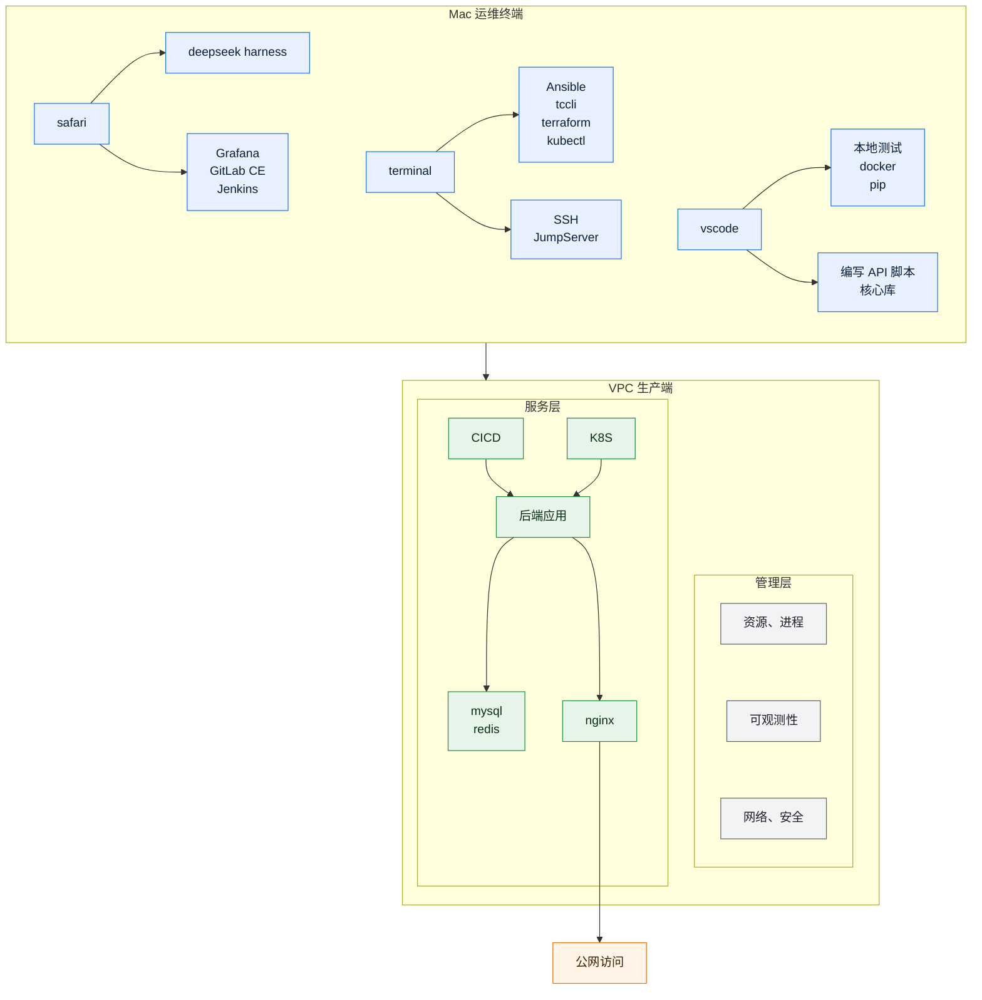
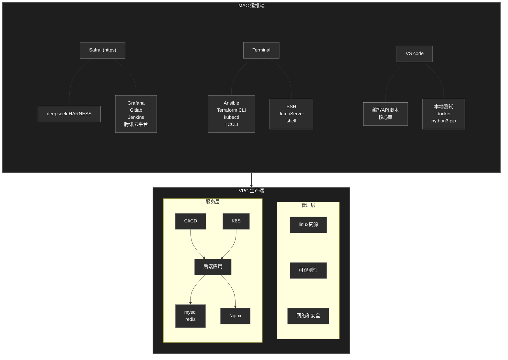

```mermaid
flowchart TB

subgraph MAC["Mac 运维终端"]
  SAF["safari"]
  DSH["deepseek harness"]
  BROWSE["Grafana<br/>GitLab CE<br/>Jenkins"]

  TER["terminal"]
  CLI["Ansible<br/>tccli<br/>terraform<br/>kubectl"]
  SSH["SSH<br/>JumpServer"]

  VSC["vscode"]
  LOCAL["本地测试<br/>docker<br/>pip"]
  API["编写 API 脚本<br/>核心库"]

  SAF --> DSH
  SAF --> BROWSE

  TER --> CLI
  TER --> SSH

  VSC --> LOCAL
  VSC --> API

  BROWSE ~~~ TER
  SSH ~~~ VSC
end

subgraph VPC["VPC 生产端"]
  direction LR

  subgraph MGMT["管理层"]
    direction TB
    M1["资源、进程"]
    M2["可观测性"]
    M3["网络、安全"]
    M1 ~~~ M2 ~~~ M3
  end

  subgraph SVC["服务层"]
    direction TB
    S1["CICD"]
    S2["K8S"]
    BE["后端应用"]
    DB["mysql<br/>redis"]
    NG["nginx"]

    S1 --> BE
    S2 --> BE
    BE --> DB
    BE --> NG
  end

end

MAC --> VPC
NG --> PUB["公网访问"]

classDef mac fill:#e8f0fe,stroke:#1a73e8,color:#0b1f3a
classDef mgmt fill:#f1f3f4,stroke:#5f6368,color:#202124
classDef svc fill:#e6f4ea,stroke:#1e8e3e,color:#0b2e13
classDef ext fill:#fff4e5,stroke:#e8710a,color:#3d1f00

class SAF,TER,VSC,DSH,BROWSE,CLI,SSH,LOCAL,API mac
class M1,M2,M3 mgmt
class S1,S2,BE,DB,NG svc
class PUB ext
```

### 

```mermaid
graph TD
    %% mac 块
    subgraph Mac["MAC 运维端"]
        direction TB
        subgraph Mac_Apps[" "]
            direction LR
            subgraph S[" "]
                direction TB
                S1["Safrai (https)"] --- S2["deepseek HARNESS"]
                S1["Safrai (https)"] --- S3["Grafana<br>Gitlab<br>Jenkins<br>腾讯云平台"]
            end
            
            subgraph T[" "]
                direction TB
                T1["Terminal"] --- T2["Ansible<br>Terraform CLI<br>kubectl<br>TCCLI"]
                T1["Terminal"] --- T3["SSH<br>JumpServer<br>shell"]
            end
            
            subgraph V[" "]
                direction TB
                V1["VS code"] --- V2["编写API脚本<br>核心库"]
                V1["VS code"] --- V3["本地测试<br>docker<br>python3 pip"]
            end
            
            S ~~~ T ~~~ V
        end
    end

    %% mac块指向vpc块
    Mac ==> VPC["mac块 -> vpc块"]

    %% vpc 块
    subgraph VPC["VPC 生产端"]
        direction TB
        
        subgraph MGMT["管理层"]
          direction TB
            M1["linux资源"]
            M2["可观测性"]
            M3["网络和安全"]
            M1 ~~~ M2 ~~~ M3
        end

          subgraph SVC["服务层"]
            direction TB
            S5["CI/CD"]
            S6["K8S"]
            BE["后端应用"]
            DB["mysql<br/>redis"]
            NG["Nginx"]

            S5 --> BE
            S6 --> BE
            BE --> DB
            BE --> NG
         end
    end


    %% 样式定义
    classDef default fill:#2d2d2d,stroke:#888,color:#fff;
    classDef group fill:#1e1e1e,stroke:#555,stroke-width:2px,color:#fff;
    classDef invisible fill:none,stroke:none;

    class Mac,VPC group;
    class Mac_Apps,S,T,V,Mgmt invisible;
```

