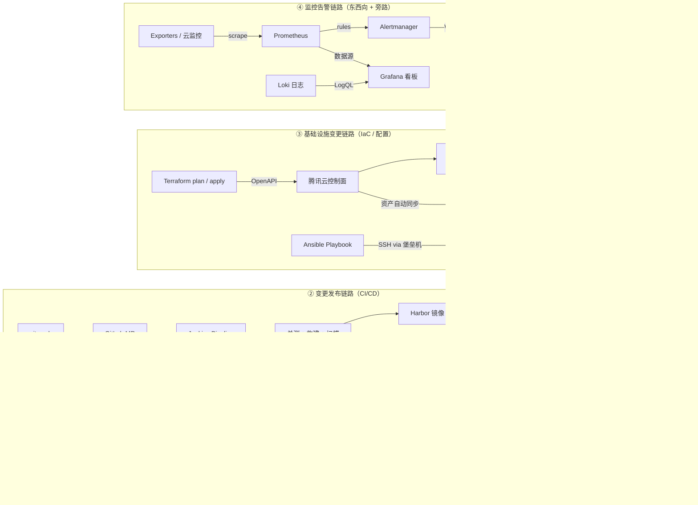

```mermaid
flowchart TB

%% ================= macOS 运维端 =================
subgraph MAC["macOS 运维端（办公网 / 运维人员）"]
  direction TB
  OPS["运维工程师<br/>SRE / DevOps"]
  BROWSER["浏览器<br/>Chrome / Safari"]
  TERM["Terminal / iTerm2<br/>Shell + 运维脚本"]
  VSCODE["VS Code<br/>Remote-SSH / Git 插件"]
  SSHCLI["SSH Client<br/>密钥 + ~/.ssh/config"]
  GIT["Git Client<br/>代码与 IaC 仓库"]
  TCCLI["tccli<br/>腾讯云命令行"]
  TFC["Terraform CLI<br/>IaC 编排"]
  ANSM["Ansible（本地）<br/>Playbook 编写 / 小批量执行"]
end

%% ================= 接入与安全边界 =================
subgraph BORDER["接入与安全边界 —— 生产端唯一入口（DMZ 子网）"]
  direction TB
  WAFN["WAF + DDoS 防护<br/>HTTPS 443 业务入口"]
  VPN["VPN / 专线 / Zero Trust<br/>管理面接入"]
  CLB["CLB 负载均衡<br/>四层 / 七层转发"]
  JSB["JumpServer 堡垒机<br/>资产纳管 · 命令审计 · 会话录屏 · 权限审批"]
end

%% ================= Linux 云服务器生产端 =================
subgraph CLOUD["Linux 云服务器生产端（腾讯云 VPC / 私有子网）"]
  direction TB

  subgraph NET["网络与入口层"]
    direction TB
    NGX["Nginx<br/>TLS 终止 · 反向代理 · 静态资源 · 限流"]
    SG["安全组 / 子网 / NAT 网关<br/>默认拒绝 · 出网收敛"]
  end

  subgraph K8S["TKE 集群 / 自建 K8s"]
    direction TB
    APIS["控制面<br/>kube-apiserver · etcd · scheduler · controller-manager"]
    ING["Ingress-Nginx<br/>七层路由"]
    WNODE["Worker Node<br/>kubelet · kube-proxy"]
    CRT["容器运行时<br/>containerd / Docker"]
    POD["业务 Pod<br/>应用服务 · /metrics 端点"]
  end

  subgraph HOST["CVM 云服务器（Linux）"]
    direction TB
    CVM["业务 CVM / 中间件 CVM<br/>非容器化负载"]
    ANSS["Ansible 控制节点<br/>生产内网批量配置"]
  end

  subgraph DATA["数据层"]
    direction TB
    MYSQL["MySQL<br/>TencentDB 主从 / 自建主从"]
    REDIS["Redis<br/>主从 · 哨兵 · 集群"]
    COS["COS 对象存储<br/>数据库备份 · 制品 · TF State"]
  end

  subgraph CICD["CI/CD 与制品"]
    direction TB
    GITLAB["GitLab<br/>代码仓库 · MR · Runner"]
    JENKINS["Jenkins<br/>流水线编排 · 构建 · 部署"]
    SONAR["SonarQube（补充）<br/>代码质量 / 安全扫描"]
    HARBOR["Harbor（补充）<br/>私有镜像仓库"]
  end

  subgraph OBS["可观测性"]
    direction TB
    EXP["Exporters（补充）<br/>node · cAdvisor · mysqld · redis · blackbox"]
    PROM["Prometheus<br/>指标采集 · 告警规则 · TSDB"]
    ALERT["Alertmanager<br/>分组 · 抑制 · 静默 · 路由"]
    GRAF["Grafana<br/>统一看板"]
    LOKI["Loki + Promtail（补充）<br/>日志聚合"]
    CLOUDMON["云监控 + CLS（补充）<br/>云产品指标与日志"]
    IM["告警通道<br/>企业微信 · 钉钉 · 短信 · 电话"]
  end

  subgraph AUTO["自动化与配置管理"]
    direction TB
    TFSTATE["Terraform 远端 State<br/>COS 后端 + CI 串行执行"]
    KMS["KMS / 密钥管理（补充）<br/>凭据与证书"]
  end
end

%% ================= 腾讯云平台（控制面） =================
subgraph TENCENT["腾讯云平台（控制面 / OpenAPI）"]
  direction TB
  TCAPI["控制台 + OpenAPI<br/>CVM · TKE · CLB · CDB · Redis · COS"]
  CAM["CAM 权限 + 密钥管理<br/>子账号 · 角色 · 策略"]
end

%% ---------- 终端到接入层 ----------
OPS --> BROWSER
OPS --> TERM
OPS --> VSCODE
OPS --> GIT
OPS --> TCCLI
OPS --> TFC
OPS --> ANSM

TERM --> SSHCLI
VSCODE --> SSHCLI

BROWSER -->|HTTPS 443 业务域名| WAFN
BROWSER -->|HTTPS 443 管理面| VPN
BROWSER -->|HTTPS 443 堡垒机 Web Terminal| JSB

SSHCLI -->|SSH 22 全公司唯一 SSH 入口| JSB
VSCODE -->|Remote-SSH 复用同一隧道| JSB
ANSM -->|SSH 22 批量执行| JSB

GIT -->|HTTPS / SSH 推送| GITLAB
TCCLI -->|HTTPS OpenAPI| TCAPI
TFC -->|HTTPS OpenAPI| TCAPI

%% ---------- 接入层到生产 ----------
WAFN --> CLB
CLB --> NGX
NGX --> ING
VPN -.->|内网直达| JSB
VPN -.->|内网直达| GITLAB
VPN -.->|内网直达| JENKINS
VPN -.->|内网直达| GRAF
JSB -.->|SSH 代理 / 运维通道| WNODE
JSB -.->|SSH 代理| CVM
JSB -.->|SSH 代理| ANSS

%% ---------- 应用链路 ----------
APIS --> WNODE
WNODE --> CRT
CRT --> POD
ING --> POD
POD -->|读写| MYSQL
POD -->|缓存 / 会话| REDIS

%% ---------- 发布链路 ----------
GITLAB -->|Webhook 触发| JENKINS
JENKINS -->|代码扫描| SONAR
JENKINS -->|docker push| HARBOR
HARBOR -->|imagePull| CRT
JENKINS -->|kubectl / helm 滚动发布| APIS
ANSS -->|配置下发| CVM

%% ---------- 可观测链路 ----------
PROM -->|scrape| EXP
EXP -.->|指标暴露| WNODE
EXP -.->|指标暴露| MYSQL
EXP -.->|指标暴露| REDIS
CLOUDMON -.->|云产品指标| PROM
PROM -->|触发告警| ALERT
ALERT -->|通知| IM
GRAF -->|PromQL| PROM
GRAF -->|LogQL| LOKI
LOKI -.->|采集容器日志| POD

%% ---------- 数据与状态 ----------
MYSQL -.->|定时全量 + binlog| COS
TFSTATE -.->|远端 state 读写| COS
KMS -.->|注入凭据| JSB
KMS -.->|注入凭据| JENKINS

%% ---------- 云平台控制面 ----------
TCAPI -.->|创建 / 变更云资源| CLB
TCAPI -.->|创建 / 变更云资源| MYSQL
TCAPI -.->|创建 / 变更云资源| APIS
TCAPI -.->|创建 / 变更云资源| COS
CAM -.->|鉴权与授权| TCAPI

%% ================= 样式 =================
classDef mac fill:#e8f0fe,stroke:#1a73e8,stroke-width:1px,color:#0b1f3a
classDef border fill:#fff4e5,stroke:#e8710a,stroke-width:1px,color:#3d1f00
classDef net fill:#e6f4ea,stroke:#1e8e3e,stroke-width:1px,color:#0b2e13
classDef app fill:#fce8e6,stroke:#c5221f,stroke-width:1px,color:#3d0a08
classDef host fill:#f1f3f4,stroke:#5f6368,stroke-width:1px,color:#202124
classDef data fill:#f3e8fd,stroke:#8430ce,stroke-width:1px,color:#2a0a45
classDef cicd fill:#e0f7fa,stroke:#00838f,stroke-width:1px,color:#00363a
classDef obs fill:#fff8e1,stroke:#f9ab00,stroke-width:1px,color:#3d2b00
classDef auto fill:#ede7f6,stroke:#5e35b1,stroke-width:1px,color:#1a0a3d
classDef cloud fill:#fee8e7,stroke:#d93025,stroke-width:1px,color:#3d0a08

class OPS,BROWSER,TERM,VSCODE,SSHCLI,GIT,TCCLI,TFC,ANSM mac
class WAFN,VPN,CLB,JSB border
class NGX,SG,ING,APIS,WNODE,CRT,POD net
class MYSQL,REDIS,COS data
class CVM,ANSS host
class GITLAB,JENKINS,SONAR,HARBOR cicd
class EXP,PROM,ALERT,GRAF,LOKI,CLOUDMON,IM obs
class TFSTATE,KMS auto
class TCAPI,CAM cloud
```

```mermaid
flowchart LR

subgraph L1["① 用户访问链路（南北向）"]
  direction LR
  U1["用户 / 客户端"] -->|HTTPS 443| W1["WAF + CLB"] --> N1["Nginx"] --> I1["Ingress-Nginx"] --> S1["Service"] --> P1["业务 Pod"]
  P1 --> D1[("MySQL")]
  P1 --> D2[("Redis")]
end

subgraph L2["② 变更发布链路（CI/CD）"]
  direction LR
  DEV["git push"] --> GL1["GitLab MR"] --> JK1["Jenkins Pipeline"] --> T1["单测 + 构建 + 扫描"] --> HR1["Harbor 镜像"] --> DP1["kubectl / Helm / ArgoCD"] --> KS1["K8s 滚动发布"]
  T1 -->|失败| BK1["阻断发布 + 通知"]
end

subgraph L3["③ 基础设施变更链路（IaC / 配置）"]
  direction LR
  TF1["Terraform plan / apply"] -->|OpenAPI| TC1["腾讯云控制面"] --> RS1["VPC · CVM · TKE · CDB · Redis · COS"]
  AN1["Ansible Playbook"] -->|SSH via 堡垒机| HS1["CVM / K8s 节点"]
  TC1 -->|资产自动同步| JS1["JumpServer 资产库"]
end

subgraph L4["④ 监控告警链路（东西向 + 旁路）"]
  direction LR
  EX1["Exporters / 云监控"] -->|scrape| PR1["Prometheus"] -->|rules| AM1["Alertmanager"] -->|Webhook| CH1["IM / 短信 / 电话"]
  PR1 -->|数据源| GF1["Grafana 看板"]
  LG1["Loki 日志"] -->|LogQL| GF1
end
```

